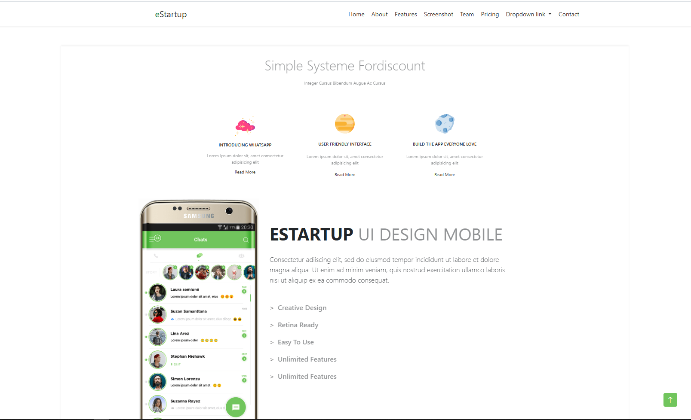

# eStartup Website

## Description

eStartup is a website for my sixth task from the Altera program. Here I use bootstraps to decorate the website page.

## Feature

- Introducing WhatsApp
- User FriendlyInterface
- Build the app everyone loves.

## Technology

- HTML
- CSS
- Bootstrap v5.3

## Condition

Web browsers (Chrome, Firefox, Safari, etc.)

## Screenshot Results

Here is a screenshot of the application view:

## How to Install

1. Clone this repository into your local directory.
2. Open the `index.html` file in your web browser.
3. You can now explore eStartup.

### Happy Code Everyone!!!
